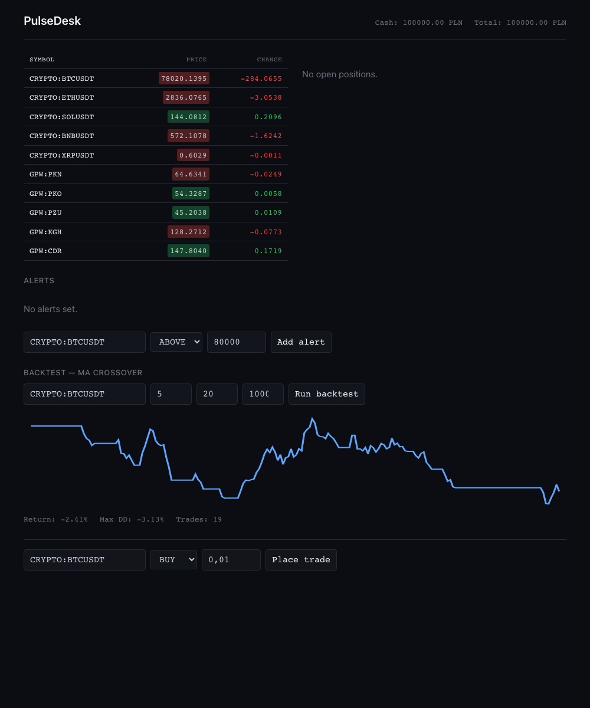

# PulseDesk

A self-hosted trading terminal for **crypto** and **Warsaw Stock Exchange (GPW)** equities —
live prices, a paper-trading portfolio, price alerts, a lightweight backtester, and an
optional AI analyst. One container, **zero paid dependencies**.



**Contents:** [What it does](#what-it-does) · [Quickstart](#quickstart) ·
[Cost: zero](#cost-zero) · [Documentation](#documentation) ·
[Architecture](#architecture-at-a-glance) · [Development](#development) ·
[Configuration](#configuration) · [Adding a market](#adding-a-market)

---

## What it does

- **Live watchlist** — prices tick in place, green on uptick, red on downtick
- **Paper portfolio** — 100,000 PLN virtual cash, market buy/sell, positions and unrealised P&L
- **Alerts** — "notify me when BTCUSDT goes above 80,000," with a browser notification on fire
- **Backtest** — run a moving-average crossover over historical candles, see the equity curve
- **AI assistant** — a drawer you open with one click, closed by default. Ask about your
  positions, concentration, or recent trades. It proposes trades; you confirm them
- **Two markets in one place** — crypto and GPW side by side, which no free terminal does well

All v1 phases are done and verified end to end. See [`docs/BUILD_ORDER.md`](docs/BUILD_ORDER.md)
for the phase-by-phase build log.

---

## Quickstart

```bash
./start.sh
```

Then open **http://localhost:8000**

No `.env` file, no API key, no account required. The default mode runs a built-in market
simulator, so a clean clone works fully offline.

<details>
<summary><strong>Streaming real prices instead of the simulator</strong></summary>

```bash
PULSEDESK_MARKET_MODE=live ./start.sh
```

Still no key required — crypto comes from Binance's public WebSocket, GPW from Stooq.

</details>

Stop it with:

```bash
./stop.sh
```

Data persists between runs in a Docker volume — see [Configuration](#configuration) if you
want a clean slate.

---

## Cost: zero

Every part of this project is free — no paid data feed, no required API key, no account,
not for development and not for live prices.

| | |
|---|---|
| Crypto prices | Binance public WebSocket — free, no key |
| GPW prices | Stooq CSV — free, no key |
| Development | Built-in simulator — free, offline |
| AI assistant | OpenRouter free-tier models — free key, **optional** |
| Everything else | SQLite, FastAPI, React, Docker — open source |

The AI assistant is the only part that takes a credential, and it's optional: without
`OPENROUTER_API_KEY` the rest of the terminal works exactly the same. Only models ending in
`:free` are accepted — the backend refuses to enable the assistant otherwise.

> **Runs locally only.** PulseDesk is not deployed anywhere and isn't designed to be — no
> cloud hosting, no domain, no TLS, no auth. Docker exists so it starts with one command on
> your own machine. Full constraint in [`PLAN.md` §2a](PLAN.md).

---

## Documentation

| Document | What's in it |
|---|---|
| [`PLAN.md`](PLAN.md) | Full specification — scope, data model, config, acceptance criteria |
| [`docs/ARCHITECTURE.md`](docs/ARCHITECTURE.md) | Why the system is shaped this way; trade-offs |
| [`docs/MARKET_DATA.md`](docs/MARKET_DATA.md) | The data-source abstraction and every free provider evaluated |
| [`docs/API.md`](docs/API.md) | HTTP endpoints and payloads |
| [`docs/AI_ASSISTANT.md`](docs/AI_ASSISTANT.md) | The optional AI drawer — design, prompts, proposal flow |
| [`docs/BUILD_ORDER.md`](docs/BUILD_ORDER.md) | Phased implementation plan and build log |
| [`CLAUDE.md`](CLAUDE.md) | Working agreement — conventions, layer rules, cost discipline |

---

## Architecture at a glance

```
                    MarketDataSource (ABC)
       ┌────────────────────┼────────────────────┐
 SimulatorDataSource  BinanceDataSource   StooqDataSource
   (GBM, offline)      (WebSocket)        (CSV, 60s poll)
       └────────────────────┼────────────────────┘
                            ▼
                       PriceCache
              ┌─────────────┼─────────────┐
              ▼             ▼             ▼
         SSE stream    portfolio      alerts
```

Every price consumer reads from `PriceCache`. Nothing downstream knows whether a price came
from Binance or from the simulator — which is what makes the simulator a first-class mode
rather than a testing hack.

---

## Development

```bash
# backend
cd backend
uv sync
uv run uvicorn app.main:app --reload    # http://localhost:8000
uv run pytest
uv run mypy app
uv run ruff check app

# frontend
cd frontend
npm install
npm run dev                             # http://localhost:5173
npm run build                           # outputs to backend/static/
```

**Stack:** FastAPI · SQLite · Vite + React + TypeScript · Docker

---

## Configuration

All optional — the defaults work.

| Variable | Default | Purpose |
|---|---|---|
| `PULSEDESK_MARKET_MODE` | `simulator` | `simulator` or `live` |
| `PULSEDESK_CURRENCY` | `PLN` | Portfolio base currency |
| `PULSEDESK_DB_PATH` | `/data/pulsedesk.db` | SQLite location — a Docker volume mount |
| `PULSEDESK_STOOQ_INTERVAL` | `60` | Seconds between GPW polls |
| `OPENROUTER_API_KEY` | *(unset)* | Enables the AI assistant — optional, see [Cost: zero](#cost-zero) |

<details>
<summary>Running the backend directly (not via <code>./start.sh</code>)</summary>

`PULSEDESK_DB_PATH` defaults to a Docker volume mount. For `uv run uvicorn` outside Docker,
point it at a local path in `.env` instead:

```bash
cp .env.example .env
# then set: PULSEDESK_DB_PATH=./data/pulsedesk.db
```

</details>

<details>
<summary>Resetting to a clean portfolio</summary>

```bash
docker compose down -v   # removes the named volume — cash resets to 100,000 PLN
./start.sh
```

</details>

---

## Adding a market

The abstraction exists to make this cheap:

1. Implement `MarketDataSource` in `backend/app/market/`
2. Register the symbol prefix in `composite.py`
3. Add seed prices so simulator mode covers the new instruments
4. Add the source to the contract-test parametrisation

Full detail in [`docs/MARKET_DATA.md`](docs/MARKET_DATA.md#adding-a-new-source).

---

## Acknowledgements

The market-data abstraction — one interface, a simulator as the default implementation, and
a live provider behind the same contract — is a pattern I studied in
[ed-donner/finally](https://github.com/ed-donner/finally) before designing this system.
PulseDesk is an independent implementation with different markets, different providers,
push-based rather than poll-based streaming, and a different feature set.

## Licence

MIT
